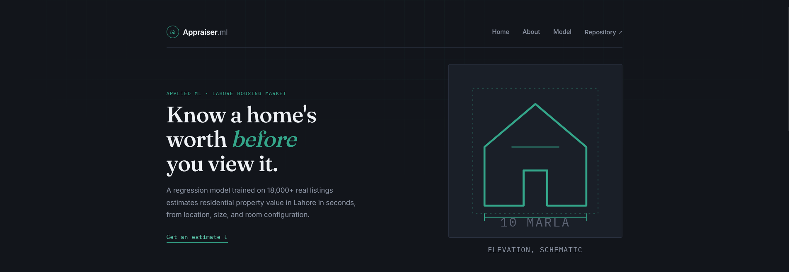
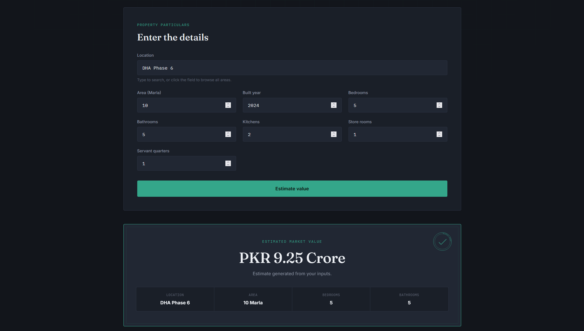
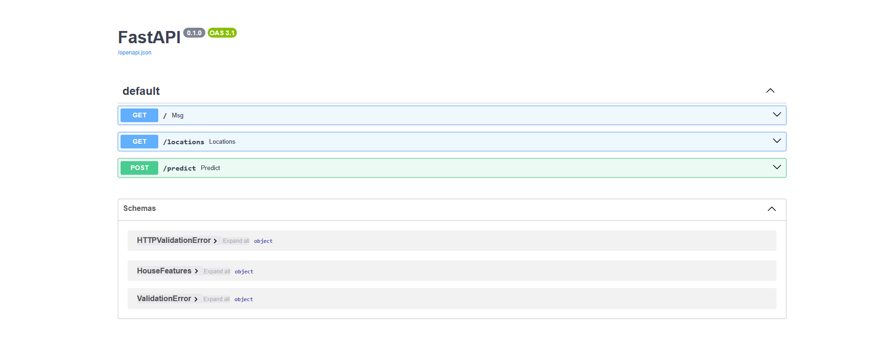

# 🏠 Lahore Real Estate Price Predictor


An end-to-end Machine Learning application that predicts residential property prices in **Lahore, Pakistan** using **Linear Regression**. The project demonstrates the complete ML workflow, from data preprocessing and feature engineering to model deployment with FastAPI and a responsive web frontend.

---

## 🚀 Live Demo

**Frontend:** *https://lahore-real-estate-price-prediction.netlify.app/*

**Backend API:** *https://lahore-real-estate-price-predictor.onrender.com*

---

## 📸 Screenshots

### Home Page



---

### Prediction Form & Result



---

### Swagger Docs



---

## 📖 Project Overview

**Problem:** Buying or selling property requires an understanding of market prices, and getting a reliable estimate in Lahore usually means manually comparing listings.

**Goal:** Use Machine Learning to estimate residential property prices in Lahore from property characteristics such as area, location, number of bedrooms, bathrooms, kitchens, built year, store rooms, and servant quarters, and expose that model through a usable web app.

**Dataset:** ~18,000 residential listings scraped from Zameen.com (see [Dataset](#-dataset) below).

**Stack:** Python, Pandas, NumPy, and Scikit-Learn for the model; FastAPI for the backend API; a vanilla HTML/CSS/JavaScript frontend; deployed on Render (API) and Netlify (frontend).

The application provides a simple web interface where users enter property details and receive an estimated market value generated by a trained Linear Regression model.

---

## ✨ Features

- Predict residential property prices in Lahore
- Responsive HTML/CSS/JavaScript frontend
- FastAPI REST API backend
- Automatic location dropdown, populated directly from the model's training data
- Input validation using Pydantic
- Feature engineering and One-Hot Encoding
- Scikit-Learn Linear Regression model
- REST API built with FastAPI
- Live deployment (Render + Netlify)
- Clean project architecture

---

## 🏗️ Application Architecture

```
                    User
                      │
                      ▼
        HTML • CSS • JavaScript Frontend
                 (Netlify Deployment)
                      │
             HTTP Requests (REST API)
                      │
                      ▼
            FastAPI Backend (Render)
           ┌────────────────────────┐
           │  GET /locations        │
           │  POST /predict         │
           └────────────────────────┘
                      │
                      ▼
      Feature Preparation & Validation
                      │
                      ▼
        Linear Regression Model (.joblib)
                      │
                      ▼
          Predicted Property Price (PKR)
```

### Request Flow

1. The user enters property details in the frontend.
2. The frontend sends the data to the FastAPI backend via a POST request.
3. FastAPI validates the request using Pydantic.
4. The backend preprocesses the input to match the model's expected feature format.
5. The trained Linear Regression model generates a price prediction.
6. The prediction is returned as JSON and displayed on the frontend.

---

## 🛠️ Tech Stack

### Machine Learning

- Python
- Pandas
- NumPy
- Scikit-Learn
- Joblib

### Backend

- FastAPI
- Uvicorn
- Pydantic

### Frontend

- HTML5
- CSS3
- JavaScript (Vanilla, no framework or build step)

### Deployment

- Render (backend API)
- Netlify (frontend)

### Development Tools

- Jupyter Notebook
- VS Code
- Git
- GitHub

---

## 📊 Dataset

[**Source**]

Lahore House Listings from Zameen.com (2025)
(https://www.kaggle.com/datasets/tahirmehmood0/lahore-house-listings-from-zameen-com-2025)

Approximately **18,000 residential property listings from Lahore** were used for training and evaluation.

### Features

| Feature | Description |
|----------|-------------|
| Area (Marla) | Property area |
| Bedrooms | Number of bedrooms |
| Bathrooms | Number of bathrooms |
| Built Year | Construction year |
| Kitchens | Number of kitchens |
| Store Rooms | Number of store rooms |
| Servant Quarters | Number of servant quarters |
| Location | Housing society / locality |

**Target**

- Property Price (PKR)

---

## ⚙️ Machine Learning Pipeline

The project follows an end-to-end supervised Machine Learning workflow.

```
Raw Dataset
      │
      ▼
Data Cleaning
      │
      ▼
Feature Engineering
      │
      ▼
Area Conversion (Marla)
      │
      ▼
Location Cleaning
      │
      ▼
One-Hot Encoding
      │
      ▼
Train/Test Split
      │
      ▼
Linear Regression
      │
      ▼
Model Evaluation
      │
      ▼
FastAPI Deployment
      │
      ▼
Frontend
```

---

## 📈 Model Performance

| Metric | Value |
|---------|-------|
| R² Score | **0.728** |
| Mean Absolute Error (MAE) | **18.86 Million PKR** |
| Root Mean Squared Error (RMSE) | **42.35 Million PKR** |

### Key Findings

- Performs best on common residential properties (approximately **5–20 Marla**).
- Prediction error increases for very large luxury properties.
- Linear Regression tends to underestimate extremely expensive houses.
- RMSE is noticeably higher than MAE, which points to a smaller number of large misses (likely high-value outliers) rather than uniformly poor predictions.
- A lower-bound safeguard is applied in the deployed API to prevent impossible negative predictions.

---

## 📂 Project Structure

```
pk-real-estate-price-predictor/

├── app/
│   ├── __init__.py
│   ├── main.py
│   ├── predictor.py
│   └── schemas.py
│
├── frontend/
│   ├── index.html
│   ├── style.css
│   └── script.js
│
├── models/
│   ├── linear_regression.joblib
│   └── feature_columns.joblib
│
├── notebooks/
│
├── requirements.txt
├── README.md
└── .gitignore
```

---

## 🔌 API

### Get Available Locations

**GET**

```
/locations
```

Returns

```json
{
  "locations": [
    "DHA Phase 6",
    "Bahria Town",
    "Johar Town"
  ]
}
```

---

### Predict Price

**POST**

```
/predict
```

Example Request

```json
{
    "Area_Marla": 10,
    "Bedrooms": 5,
    "Bathrooms": 5,
    "Built_Year": 2024,
    "Kitchens": 2,
    "Store_Rooms": 1,
    "Servant_Quarters": 1,
    "Location": "DHA Phase 6"
}
```

Example Response

```json
{
    "predicted_price": 48750000
}
```

---

## 🖥️ Frontend

The frontend is a static, framework-free HTML/CSS/JavaScript app that talks to the FastAPI backend over the two endpoints above.

```
frontend/
├── index.html
├── style.css
└── script.js
```

**How it works**

- On load, it calls `GET /locations` and populates a searchable location field (type to filter, or browse the full list) so users don't have to guess how a locality is spelled in the dataset.
- On submit, it packages the form into the exact payload the API expects and calls `POST /predict`, then formats the returned price into Lakh/Crore for readability.

**Configuration**

`script.js` defines a single constant at the top of the file:

```js
const API_URL = "http://127.0.0.1:8000";
```

This points at your local FastAPI server by default. Before deploying the frontend (e.g. to Netlify), update it to your deployed backend URL:

```js
const API_URL = "https://lahore-real-estate-price-predictor.onrender.com";
```

**CORS**

Because the frontend and backend are deployed on different origins (Netlify and Render), the FastAPI backend needs CORS middleware enabling the frontend's origin, or browser requests from the deployed site will be blocked even though the API itself is reachable. Locally, this matters less, but it's required for the live deployment to work.

**Running it locally**

1. Start the backend: `uvicorn app.main:app --reload`
2. Open `frontend/index.html` directly in a browser, or serve the folder with a simple static server:
   ```bash
   cd frontend
   python -m http.server
   ```
3. Make sure `API_URL` in `script.js` points at wherever the backend is running.

---

## 💻 Installation

Clone the repository

```bash
git clone https://github.com/Jahanzeb-abbasi/lahore-real-estate-price-predictor.git
```

Move into the project

```bash
cd lahore-real-estate-price-predictor
```

Create a virtual environment

```bash
python -m venv venv
```

Activate the virtual environment

### Windows

```bash
venv\Scripts\activate
```

### Linux / macOS

```bash
source venv/bin/activate
```

Install dependencies

```bash
pip install -r requirements.txt
```

Run the FastAPI server

```bash
uvicorn app.main:app --reload
```

Open your browser

```
http://127.0.0.1:8000/docs
```

For running the frontend against this local server, see the [Frontend](#-frontend) section above.

---

## ⚠️ Limitations

### Dataset Limitations

- Listings are from Lahore only; the model doesn't generalize to other cities.
- Prices reflect scraped **listing (asking) prices**, not confirmed sale prices.
- Market prices shift over time, and the model isn't automatically retrained as the market moves.

### Model Limitations

- Uses Linear Regression only, which assumes a linear relationship between features and price.
- Performance decreases for luxury properties (**>40 Marla**).
- Performance decreases for areas with limited listings (**<20 houses**).
- Does not estimate prediction confidence or a margin of error, just a single point estimate.
- Rare feature combinations may produce unrealistic predictions; a minimum-price safeguard is applied in the deployed API to avoid negative values.

### Feature Limitations

The current model does not include:

- Plot dimensions
- Road width
- Corner plot status
- Park-facing status
- Furnished status
- Condition of the property
- Nearby amenities
- Distance to commercial areas
- Geographic coordinates

These missing variables likely explain some of the remaining prediction error, and are natural candidates for the next iteration.

---

## 🧗 Challenges Faced

Building this project involved solving several practical engineering challenges beyond model training:

- Cleaning inconsistent location names from the raw dataset.
- Converting mixed area units (Marla, Kanal, Square Feet, etc.) into a single standard unit.
- Engineering features while preserving compatibility between training and inference.
- Handling locations not present in the training data during prediction.
- Building a FastAPI backend that could reliably serve predictions.
- Connecting a static HTML/CSS/JavaScript frontend with a deployed REST API.
- Configuring CORS so the Netlify frontend could communicate with the Render backend.
- Resolving deployment issues caused by Python version mismatches and unnecessary dependencies in `requirements.txt`.

---

## 🚀 Future Improvements

As this was my first end-to-end Machine Learning project, there are several areas I'd like to explore as I continue learning and building more advanced ML applications.

- Compare Linear Regression with more advanced regression models such as Random Forest, XGBoost, and CatBoost.
- Perform hyperparameter tuning to improve model performance.
- Incorporate additional property features.
- Retrain the model with newer housing market data to keep predictions up to date.
- Improve prediction accuracy for luxury and high-value properties.
- Enhance the frontend with data visualizations and richer property insights.
- Containerize the application using Docker for easier deployment.

---

## 🏆 Key Achievements

- Built an end-to-end machine learning application, from data preprocessing to cloud deployment.
- Designed a REST API using FastAPI, with validated request/response schemas.
- Developed a responsive frontend using HTML, CSS, and JavaScript, with no framework dependency.
- Deployed the backend on Render and the frontend on Netlify as two independently hosted services.
- Achieved an R² score of approximately 0.73 on unseen test data with a simple, interpretable baseline model.

---

## 📚 What I Learned

Through this project I gained practical experience with:

- Exploratory Data Analysis (EDA)
- Data Cleaning
- Feature Engineering
- Handling Missing Values
- One-Hot Encoding
- Regression Modeling
- Model Evaluation
- Error Analysis
- REST API Development
- FastAPI
- Frontend Integration
- Connecting a static frontend to a deployed API, including CORS and environment-specific config
- Git & GitHub
- End-to-End Machine Learning Deployment

---

## ⚠️ Disclaimer

This project was developed for educational and portfolio purposes. Predictions are estimates generated by a machine learning model and should not be considered professional real estate valuations or financial advice.

---

## 👨‍💻 Author

**Jahanzeb Abbasi**

Applied AI & Machine Learning Enthusiast

GitHub: https://github.com/Jahanzeb-abbasi

---

## ⭐ Acknowledgements

- Zafar Iqbal, for his AI/ML content on YouTube, which shaped how I approached this project
- Zameen.com for the housing dataset
- Kaggle for dataset hosting
- Scikit-Learn documentation
- FastAPI documentation

---

If you found this project useful, consider giving it a ⭐ on GitHub!
